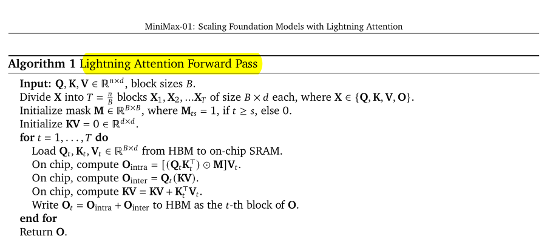

### To - Do's 
- [x] Lightning Attention

### Notes
* the lightning attention was introduced in the minimax [paper](https://arxiv.org/abs/2501.08313)
* in the lightning attention forward pass we can see that there is a mat mul part and we can bind the O_intra with a softmax 
* so we have to make a mat mul kernel and softmax kernel & then we will make a lightning attention function to write the forward pass
* i will be going for the naive mat mul kernel & naive softmax kernel
* i will be using my previous implementations for both

