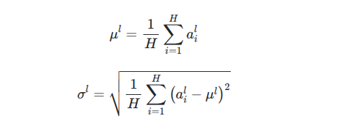

### To-Do's
- [x] cuBLAS Strided Batched GEMM Kernel
- [x] Naive Layer Norm Kernel

### Notes
* one small observation that i found is that while playing around the batch count for the gemm, 32 & 64 were the sweet spot for the operation on my 4050 (6gb)
---
* layer normalization by computing the mean and variance used for normalization from all of the summed inputs to the neurons in a layer on a single training case
* layer normalization performs exactly the same computation at training and test times
* layer normalization directly estimates the normalization statistics from the summed inputs to the neurons within a hidden layer so the normalization does not introduce any new dependencies between training cases
* it works well for RNNs and improves both the training time and the generalization performance of several existing RNN models
* layer normalization does not impose any constraint on the size of the mini-batch and it can be used in the pure online regime with batch size 1
---
